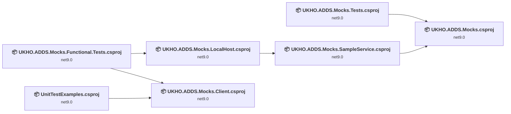
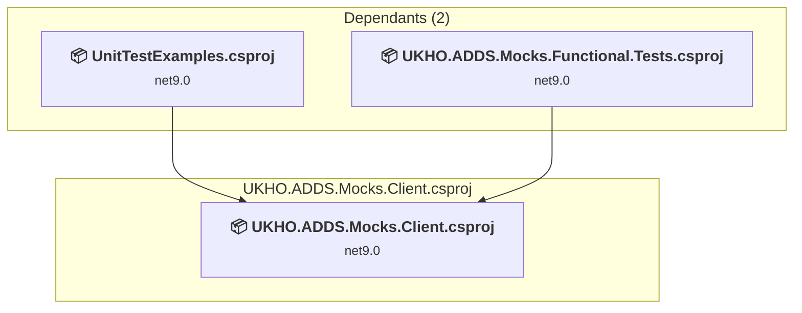
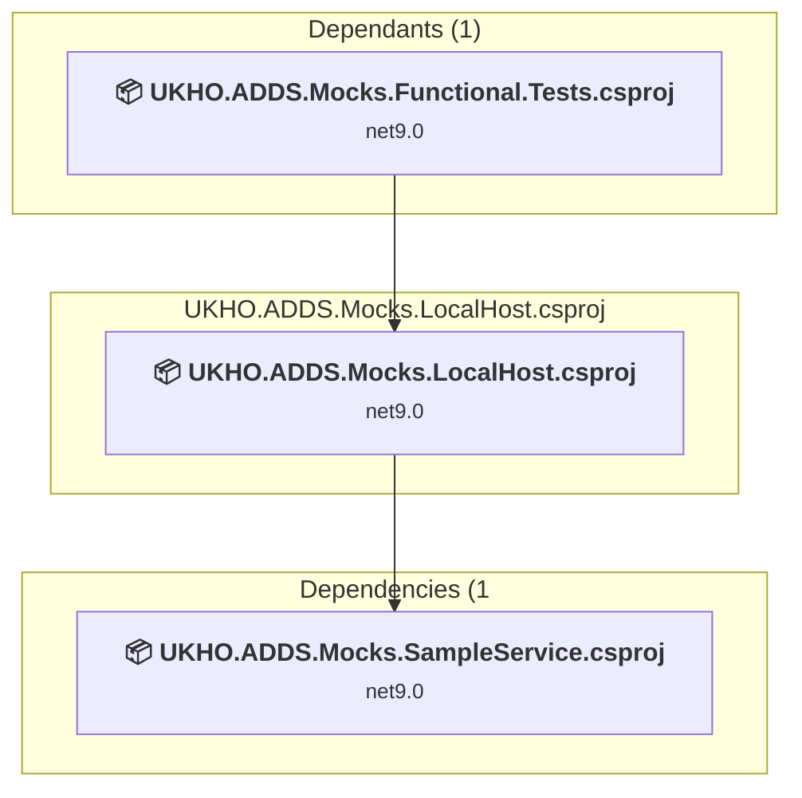
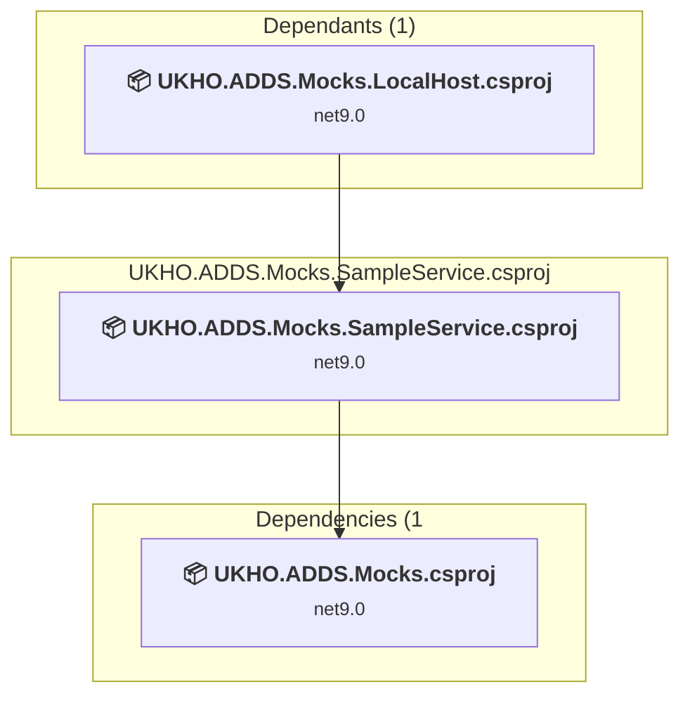
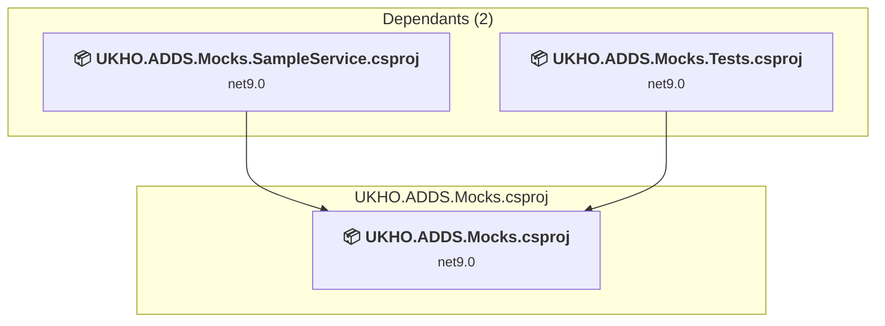
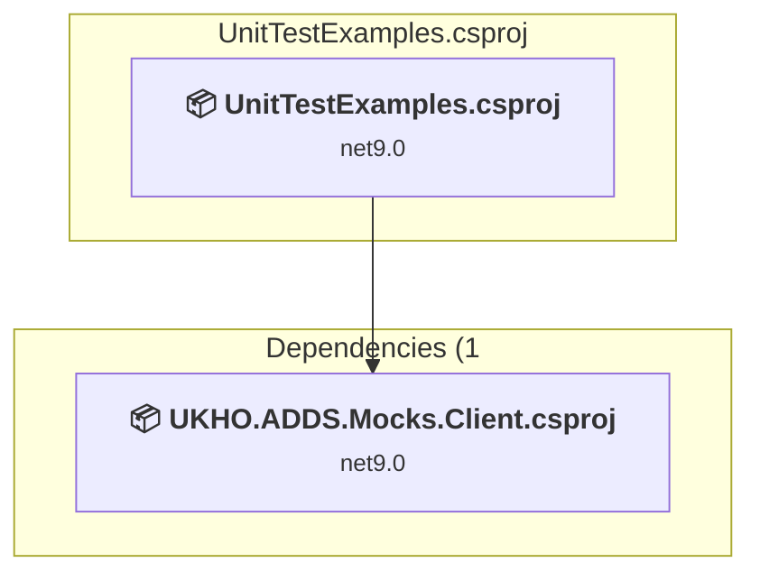
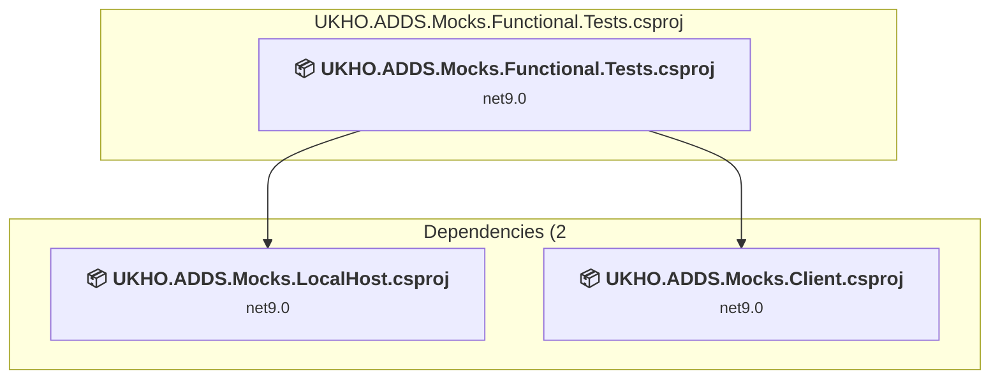
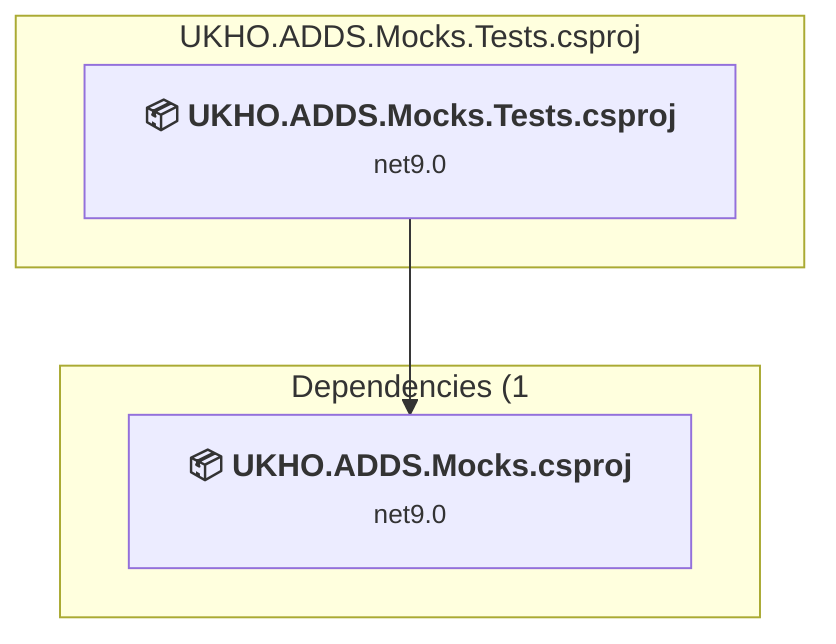

# Projects and dependencies analysis

This document provides a comprehensive overview of the projects and their dependencies in the context of upgrading to .NETCoreApp,Version=v10.0.

## Table of Contents

- [Executive Summary](#executive-Summary)
  - [Highlevel Metrics](#highlevel-metrics)
  - [Projects Compatibility](#projects-compatibility)
  - [Package Compatibility](#package-compatibility)
  - [API Compatibility](#api-compatibility)
  - [Binding Redirect Configuration](#binding-redirect-configuration)
- [Aggregate NuGet packages details](#aggregate-nuget-packages-details)
- [Top API Migration Challenges](#top-api-migration-challenges)
  - [Technologies and Features](#technologies-and-features)
  - [Most Frequent API Issues](#most-frequent-api-issues)
- [Projects Relationship Graph](#projects-relationship-graph)
- [Project Details](#project-details)

  - [src\UKHO.ADDS.Mocks.Client\UKHO.ADDS.Mocks.Client.csproj](#srcukhoaddsmocksclientukhoaddsmocksclientcsproj)
  - [src\UKHO.ADDS.Mocks.LocalHost\UKHO.ADDS.Mocks.LocalHost.csproj](#srcukhoaddsmockslocalhostukhoaddsmockslocalhostcsproj)
  - [src\UKHO.ADDS.Mocks.SampleService\UKHO.ADDS.Mocks.SampleService.csproj](#srcukhoaddsmockssampleserviceukhoaddsmockssampleservicecsproj)
  - [src\UKHO.ADDS.Mocks\UKHO.ADDS.Mocks.csproj](#srcukhoaddsmocksukhoaddsmockscsproj)
  - [src\UnitTestExamples\UnitTestExamples.csproj](#srcunittestexamplesunittestexamplescsproj)
  - [tests\UKHO.ADDS.Mocks.Functional.Tests\UKHO.ADDS.Mocks.Functional.Tests.csproj](#testsukhoaddsmocksfunctionaltestsukhoaddsmocksfunctionaltestscsproj)
  - [tests\UKHO.ADDS.Mocks.Tests\UKHO.ADDS.Mocks.Tests.csproj](#testsukhoaddsmockstestsukhoaddsmockstestscsproj)

## Executive Summary

### Highlevel Metrics

| Metric | Count | Status |
| :--- | :---: | :--- |
| Total Projects | 7 | All require upgrade |
| Total NuGet Packages | 33 | 9 need upgrade |
| Total Code Files | 182 |  |
| Total Code Files with Incidents | 21 |  |
| Total Lines of Code | 21985 |  |
| Total Number of Issues | 90 |  |
| Estimated LOC to modify | 68+ | at least 0.3% of codebase |

### Projects Compatibility

| Project | Target Framework | Difficulty | Package Issues | API Issues | Binding Issues | Est. LOC Impact | Description |
| :--- | :---: | :---: | :---: | :---: | :---: | :---: | :--- |
| [src\UKHO.ADDS.Mocks.Client\UKHO.ADDS.Mocks.Client.csproj](#srcukhoaddsmocksclientukhoaddsmocksclientcsproj) | net9.0 | 🟢 Low | 1 | 0 | 0 |  | ClassLibrary, Sdk Style = True |
| [src\UKHO.ADDS.Mocks.LocalHost\UKHO.ADDS.Mocks.LocalHost.csproj](#srcukhoaddsmockslocalhostukhoaddsmockslocalhostcsproj) | net9.0 | 🟢 Low | 3 | 0 | 0 |  | DotNetCoreApp, Sdk Style = True |
| [src\UKHO.ADDS.Mocks.SampleService\UKHO.ADDS.Mocks.SampleService.csproj](#srcukhoaddsmockssampleserviceukhoaddsmockssampleservicecsproj) | net9.0 | 🟢 Low | 1 | 1 | 0 | 1+ | AspNetCore, Sdk Style = True |
| [src\UKHO.ADDS.Mocks\UKHO.ADDS.Mocks.csproj](#srcukhoaddsmocksukhoaddsmockscsproj) | net9.0 | 🟢 Low | 6 | 42 | 0 | 42+ | AspNetCore, Sdk Style = True |
| [src\UnitTestExamples\UnitTestExamples.csproj](#srcunittestexamplesunittestexamplescsproj) | net9.0 | 🟢 Low | 1 | 0 | 0 |  | DotNetCoreApp, Sdk Style = True |
| [tests\UKHO.ADDS.Mocks.Functional.Tests\UKHO.ADDS.Mocks.Functional.Tests.csproj](#testsukhoaddsmocksfunctionaltestsukhoaddsmocksfunctionaltestscsproj) | net9.0 | 🟢 Low | 2 | 11 | 0 | 11+ | DotNetCoreApp, Sdk Style = True |
| [tests\UKHO.ADDS.Mocks.Tests\UKHO.ADDS.Mocks.Tests.csproj](#testsukhoaddsmockstestsukhoaddsmockstestscsproj) | net9.0 | 🟢 Low | 1 | 14 | 0 | 14+ | DotNetCoreApp, Sdk Style = True |

### Package Compatibility

| Status | Count | Percentage |
| :--- | :---: | :---: |
| ✅ Compatible | 24 | 72.7% |
| ⚠️ Incompatible | 1 | 3.0% |
| 🔄 Upgrade Recommended | 8 | 24.2% |
| ***Total NuGet Packages*** | ***33*** | ***100%*** |

### API Compatibility

| Category | Count | Impact |
| :--- | :---: | :--- |
| 🔴 Binary Incompatible | 0 | High - Require code changes |
| 🟡 Source Incompatible | 4 | Medium - Needs re-compilation and potential conflicting API error fixing |
| 🔵 Behavioral change | 64 | Low - Behavioral changes that may require testing at runtime |
| ✅ Compatible | 18459 |  |
| ***Total APIs Analyzed*** | ***18527*** |  |

## Aggregate NuGet packages details

| Package | Current Version | Suggested Version | Projects | Description |
| :--- | :---: | :---: | :--- | :--- |
| Aspire.Hosting.AppHost | 9.5.2 | 13.6.0 | [UKHO.ADDS.Mocks.LocalHost.csproj](#srcukhoaddsmockslocalhostukhoaddsmockslocalhostcsproj) | NuGet package upgrade is recommended |
| Aspire.Hosting.Testing | 9.5.2 | 13.6.0 | [UKHO.ADDS.Mocks.Functional.Tests.csproj](#testsukhoaddsmocksfunctionaltestsukhoaddsmocksfunctionaltestscsproj) | NuGet package upgrade is recommended |
| CloudNative.CloudEvents | 2.9.0 |  | [UKHO.ADDS.Mocks.csproj](#srcukhoaddsmocksukhoaddsmockscsproj) | ✅Compatible |
| coverlet.collector | 8.0.1 |  | [UKHO.ADDS.Mocks.Functional.Tests.csproj](#testsukhoaddsmocksfunctionaltestsukhoaddsmocksfunctionaltestscsproj) | ✅Compatible |
| MetadataReferenceService.BlazorWasm | * |  | [UKHO.ADDS.Mocks.csproj](#srcukhoaddsmocksukhoaddsmockscsproj) | ✅Compatible |
| Microsoft.AspNetCore.Components.WebAssembly | 9.*-* | 10.0.12 | [UKHO.ADDS.Mocks.csproj](#srcukhoaddsmocksukhoaddsmockscsproj) | NuGet package upgrade is recommended |
| Microsoft.AspNetCore.Components.WebAssembly.DevServer | 9.*-* | 10.0.12 | [UKHO.ADDS.Mocks.csproj](#srcukhoaddsmocksukhoaddsmockscsproj) | NuGet package upgrade is recommended |
| Microsoft.AspNetCore.Mvc.Razor.Extensions | 6.0.36 |  | [UKHO.ADDS.Mocks.csproj](#srcukhoaddsmocksukhoaddsmockscsproj) | NuGet package functionality is included with framework reference |
| Microsoft.AspNetCore.OpenApi | 9.0.19 | 10.0.12 | [UKHO.ADDS.Mocks.csproj](#srcukhoaddsmocksukhoaddsmockscsproj) [UKHO.ADDS.Mocks.SampleService.csproj](#srcukhoaddsmockssampleserviceukhoaddsmockssampleservicecsproj) | NuGet package upgrade is recommended |
| Microsoft.CodeAnalysis.Analyzers | 5.9.0 |  | [UKHO.ADDS.Mocks.csproj](#srcukhoaddsmocksukhoaddsmockscsproj) | ✅Compatible |
| Microsoft.CodeAnalysis.CSharp | 5.9.0 |  | [UKHO.ADDS.Mocks.csproj](#srcukhoaddsmocksukhoaddsmockscsproj) | ✅Compatible |
| Microsoft.CodeAnalysis.Razor | 6.0.36 |  | [UKHO.ADDS.Mocks.csproj](#srcukhoaddsmocksukhoaddsmockscsproj) | NuGet package functionality is included with framework reference |
| Microsoft.EntityFrameworkCore.InMemory | 9.*-* | 10.0.12 | [UKHO.ADDS.Mocks.csproj](#srcukhoaddsmocksukhoaddsmockscsproj) | NuGet package upgrade is recommended |
| Microsoft.Extensions.Http | 10.0.11 | 10.0.12 | [UKHO.ADDS.Mocks.Client.csproj](#srcukhoaddsmocksclientukhoaddsmocksclientcsproj) | NuGet package upgrade is recommended |
| Microsoft.Extensions.Http | 9.0.19 | 10.0.12 | [UKHO.ADDS.Mocks.LocalHost.csproj](#srcukhoaddsmockslocalhostukhoaddsmockslocalhostcsproj) | NuGet package upgrade is recommended |
| Microsoft.Extensions.Telemetry.Abstractions | 10.9.0 |  | [UKHO.ADDS.Mocks.csproj](#srcukhoaddsmocksukhoaddsmockscsproj) | ✅Compatible |
| Microsoft.Extensions.Telemetry.Abstractions | 9.10.0 |  | [UKHO.ADDS.Mocks.Functional.Tests.csproj](#testsukhoaddsmocksfunctionaltestsukhoaddsmocksfunctionaltestscsproj) | ✅Compatible |
| Microsoft.NET.Test.Sdk | 18.9.0 |  | [UKHO.ADDS.Mocks.Functional.Tests.csproj](#testsukhoaddsmocksfunctionaltestsukhoaddsmocksfunctionaltestscsproj) [UKHO.ADDS.Mocks.Tests.csproj](#testsukhoaddsmockstestsukhoaddsmockstestscsproj) [UnitTestExamples.csproj](#srcunittestexamplesunittestexamplescsproj) | ✅Compatible |
| NUnit | 4.6.1 |  | [UKHO.ADDS.Mocks.Functional.Tests.csproj](#testsukhoaddsmocksfunctionaltestsukhoaddsmocksfunctionaltestscsproj) | ✅Compatible |
| NUnit.Analyzers | 4.14.0 |  | [UKHO.ADDS.Mocks.Functional.Tests.csproj](#testsukhoaddsmocksfunctionaltestsukhoaddsmocksfunctionaltestscsproj) | ✅Compatible |
| NUnit3TestAdapter | 6.2.0 |  | [UKHO.ADDS.Mocks.Functional.Tests.csproj](#testsukhoaddsmocksfunctionaltestsukhoaddsmocksfunctionaltestscsproj) | ✅Compatible |
| Radzen.Blazor | 8.7.5 |  | [UKHO.ADDS.Mocks.csproj](#srcukhoaddsmocksukhoaddsmockscsproj) | ✅Compatible |
| Scalar.AspNetCore | 2.17.2 |  | [UKHO.ADDS.Mocks.csproj](#srcukhoaddsmocksukhoaddsmockscsproj) | ✅Compatible |
| Serilog.AspNetCore | 10.0.0 |  | [UKHO.ADDS.Mocks.csproj](#srcukhoaddsmocksukhoaddsmockscsproj) | ✅Compatible |
| Serilog.Expressions | 5.0.0 |  | [UKHO.ADDS.Mocks.csproj](#srcukhoaddsmocksukhoaddsmockscsproj) | ✅Compatible |
| Serilog.Sinks.Console | 6.1.1 |  | [UKHO.ADDS.Mocks.LocalHost.csproj](#srcukhoaddsmockslocalhostukhoaddsmockslocalhostcsproj) | ✅Compatible |
| Serilog.Sinks.OpenTelemetry | 4.2.0 |  | [UKHO.ADDS.Mocks.csproj](#srcukhoaddsmocksukhoaddsmockscsproj) | ✅Compatible |
| System.IO.Abstractions | 22.2.0 |  | [UKHO.ADDS.Mocks.csproj](#srcukhoaddsmocksukhoaddsmockscsproj) | ✅Compatible |
| UKHO.ADDS.Infrastructure.Results | 0.0.60930-alpha.7 |  | [UKHO.ADDS.Mocks.csproj](#srcukhoaddsmocksukhoaddsmockscsproj) | ✅Compatible |
| UKHO.ADDS.Infrastructure.Serialization | 0.0.60930-alpha.7 |  | [UKHO.ADDS.Mocks.csproj](#srcukhoaddsmocksukhoaddsmockscsproj) | ✅Compatible |
| xunit | 2.9.3 |  | [UKHO.ADDS.Mocks.Tests.csproj](#testsukhoaddsmockstestsukhoaddsmockstestscsproj) [UnitTestExamples.csproj](#srcunittestexamplesunittestexamplescsproj) | ⚠️NuGet package is deprecated |
| xunit.runner.visualstudio | 3.1.5 |  | [UKHO.ADDS.Mocks.Tests.csproj](#testsukhoaddsmockstestsukhoaddsmockstestscsproj) [UnitTestExamples.csproj](#srcunittestexamplesunittestexamplescsproj) | ✅Compatible |
| Zio | 0.24.0 |  | [UKHO.ADDS.Mocks.csproj](#srcukhoaddsmocksukhoaddsmockscsproj) | ✅Compatible |

## Top API Migration Challenges

### Technologies and Features

| Technology | Issues | Percentage | Migration Path |
| :--- | :---: | :---: | :--- |

### Most Frequent API Issues

| API | Count | Percentage | Category |
| :--- | :---: | :---: | :--- |
| T:System.Uri | 52 | 76.5% | Behavioral Change |
| M:System.Uri.#ctor(System.String) | 4 | 5.9% | Behavioral Change |
| T:System.Text.Json.JsonDocument | 2 | 2.9% | Behavioral Change |
| P:System.Uri.AbsolutePath | 2 | 2.9% | Behavioral Change |
| T:System.Net.Http.HttpContent | 2 | 2.9% | Behavioral Change |
| M:System.String.Join(System.String,System.ReadOnlySpan{System.String}) | 1 | 1.5% | Source Incompatible |
| M:System.String.Concat(System.ReadOnlySpan{System.Object}) | 1 | 1.5% | Source Incompatible |
| M:System.TimeSpan.FromSeconds(System.Int64) | 1 | 1.5% | Source Incompatible |
| M:System.Uri.#ctor(System.Uri,System.String) | 1 | 1.5% | Behavioral Change |
| M:System.Uri.#ctor(System.String,System.UriKind) | 1 | 1.5% | Behavioral Change |
| M:System.Threading.Tasks.Task.WaitAll(System.ReadOnlySpan{System.Threading.Tasks.Task}) | 1 | 1.5% | Source Incompatible |

## Projects Relationship Graph

Legend:
📦 SDK-style project
⚙️ Classic project

## Project Details

### src\UKHO.ADDS.Mocks.Client\UKHO.ADDS.Mocks.Client.csproj

#### Project Info

- **Current Target Framework:** net9.0
- **Proposed Target Framework:** net10.0
- **SDK-style**: True
- **Project Kind:** ClassLibrary
- **Dependencies**: 0
- **Dependants**: 2
- **Number of Files**: 4
- **Number of Files with Incidents**: 1
- **Lines of Code**: 157
- **Estimated LOC to modify**: 0+ (at least 0.0% of the project)

#### Dependency Graph

Legend:
📦 SDK-style project
⚙️ Classic project

### API Compatibility

| Category | Count | Impact |
| :--- | :---: | :--- |
| 🔴 Binary Incompatible | 0 | High - Require code changes |
| 🟡 Source Incompatible | 0 | Medium - Needs re-compilation and potential conflicting API error fixing |
| 🔵 Behavioral change | 0 | Low - Behavioral changes that may require testing at runtime |
| ✅ Compatible | 169 |  |
| ***Total APIs Analyzed*** | ***169*** |  |

### src\UKHO.ADDS.Mocks.LocalHost\UKHO.ADDS.Mocks.LocalHost.csproj

#### Project Info

- **Current Target Framework:** net9.0
- **Proposed Target Framework:** net10.0
- **SDK-style**: True
- **Project Kind:** DotNetCoreApp
- **Dependencies**: 1
- **Dependants**: 1
- **Number of Files**: 3
- **Number of Files with Incidents**: 1
- **Lines of Code**: 68
- **Estimated LOC to modify**: 0+ (at least 0.0% of the project)

#### Dependency Graph

Legend:
📦 SDK-style project
⚙️ Classic project

### API Compatibility

| Category | Count | Impact |
| :--- | :---: | :--- |
| 🔴 Binary Incompatible | 0 | High - Require code changes |
| 🟡 Source Incompatible | 0 | Medium - Needs re-compilation and potential conflicting API error fixing |
| 🔵 Behavioral change | 0 | Low - Behavioral changes that may require testing at runtime |
| ✅ Compatible | 102 |  |
| ***Total APIs Analyzed*** | ***102*** |  |

### src\UKHO.ADDS.Mocks.SampleService\UKHO.ADDS.Mocks.SampleService.csproj

#### Project Info

- **Current Target Framework:** net9.0
- **Proposed Target Framework:** net10.0
- **SDK-style**: True
- **Project Kind:** AspNetCore
- **Dependencies**: 1
- **Dependants**: 1
- **Number of Files**: 13
- **Number of Files with Incidents**: 2
- **Lines of Code**: 483
- **Estimated LOC to modify**: 1+ (at least 0.2% of the project)

#### Dependency Graph

Legend:
📦 SDK-style project
⚙️ Classic project

### API Compatibility

| Category | Count | Impact |
| :--- | :---: | :--- |
| 🔴 Binary Incompatible | 0 | High - Require code changes |
| 🟡 Source Incompatible | 0 | Medium - Needs re-compilation and potential conflicting API error fixing |
| 🔵 Behavioral change | 1 | Low - Behavioral changes that may require testing at runtime |
| ✅ Compatible | 467 |  |
| ***Total APIs Analyzed*** | ***468*** |  |

### src\UKHO.ADDS.Mocks\UKHO.ADDS.Mocks.csproj

#### Project Info

- **Current Target Framework:** net9.0
- **Proposed Target Framework:** net10.0
- **SDK-style**: True
- **Project Kind:** AspNetCore
- **Dependencies**: 0
- **Dependants**: 2
- **Number of Files**: 151
- **Number of Files with Incidents**: 10
- **Lines of Code**: 14629
- **Estimated LOC to modify**: 42+ (at least 0.3% of the project)

#### Dependency Graph

Legend:
📦 SDK-style project
⚙️ Classic project

### API Compatibility

| Category | Count | Impact |
| :--- | :---: | :--- |
| 🔴 Binary Incompatible | 0 | High - Require code changes |
| 🟡 Source Incompatible | 2 | Medium - Needs re-compilation and potential conflicting API error fixing |
| 🔵 Behavioral change | 40 | Low - Behavioral changes that may require testing at runtime |
| ✅ Compatible | 12430 |  |
| ***Total APIs Analyzed*** | ***12472*** |  |

### src\UnitTestExamples\UnitTestExamples.csproj

#### Project Info

- **Current Target Framework:** net9.0
- **Proposed Target Framework:** net10.0
- **SDK-style**: True
- **Project Kind:** DotNetCoreApp
- **Dependencies**: 1
- **Dependants**: 0
- **Number of Files**: 3
- **Number of Files with Incidents**: 1
- **Lines of Code**: 73
- **Estimated LOC to modify**: 0+ (at least 0.0% of the project)

#### Dependency Graph

Legend:
📦 SDK-style project
⚙️ Classic project

### API Compatibility

| Category | Count | Impact |
| :--- | :---: | :--- |
| 🔴 Binary Incompatible | 0 | High - Require code changes |
| 🟡 Source Incompatible | 0 | Medium - Needs re-compilation and potential conflicting API error fixing |
| 🔵 Behavioral change | 0 | Low - Behavioral changes that may require testing at runtime |
| ✅ Compatible | 87 |  |
| ***Total APIs Analyzed*** | ***87*** |  |

### tests\UKHO.ADDS.Mocks.Functional.Tests\UKHO.ADDS.Mocks.Functional.Tests.csproj

#### Project Info

- **Current Target Framework:** net9.0
- **Proposed Target Framework:** net10.0
- **SDK-style**: True
- **Project Kind:** DotNetCoreApp
- **Dependencies**: 2
- **Dependants**: 0
- **Number of Files**: 4
- **Number of Files with Incidents**: 3
- **Lines of Code**: 111
- **Estimated LOC to modify**: 11+ (at least 9.9% of the project)

#### Dependency Graph

Legend:
📦 SDK-style project
⚙️ Classic project

### API Compatibility

| Category | Count | Impact |
| :--- | :---: | :--- |
| 🔴 Binary Incompatible | 0 | High - Require code changes |
| 🟡 Source Incompatible | 1 | Medium - Needs re-compilation and potential conflicting API error fixing |
| 🔵 Behavioral change | 10 | Low - Behavioral changes that may require testing at runtime |
| ✅ Compatible | 133 |  |
| ***Total APIs Analyzed*** | ***144*** |  |

### tests\UKHO.ADDS.Mocks.Tests\UKHO.ADDS.Mocks.Tests.csproj

#### Project Info

- **Current Target Framework:** net9.0
- **Proposed Target Framework:** net10.0
- **SDK-style**: True
- **Project Kind:** DotNetCoreApp
- **Dependencies**: 1
- **Dependants**: 0
- **Number of Files**: 46
- **Number of Files with Incidents**: 3
- **Lines of Code**: 6464
- **Estimated LOC to modify**: 14+ (at least 0.2% of the project)

#### Dependency Graph

Legend:
📦 SDK-style project
⚙️ Classic project

### API Compatibility

| Category | Count | Impact |
| :--- | :---: | :--- |
| 🔴 Binary Incompatible | 0 | High - Require code changes |
| 🟡 Source Incompatible | 1 | Medium - Needs re-compilation and potential conflicting API error fixing |
| 🔵 Behavioral change | 13 | Low - Behavioral changes that may require testing at runtime |
| ✅ Compatible | 5071 |  |
| ***Total APIs Analyzed*** | ***5085*** |  |

